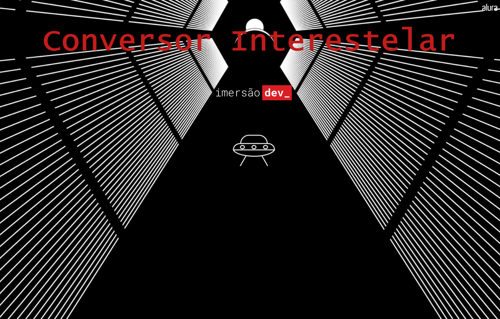
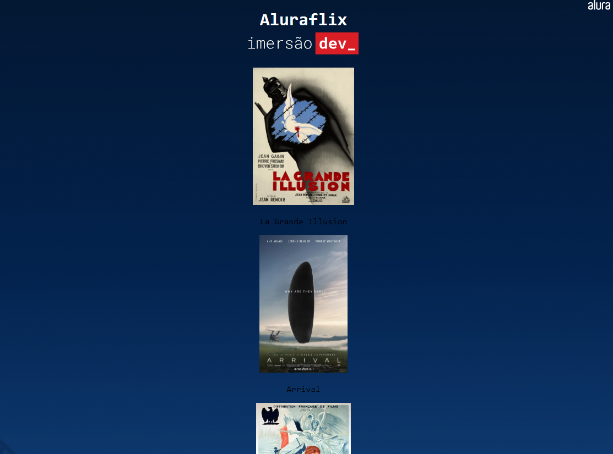
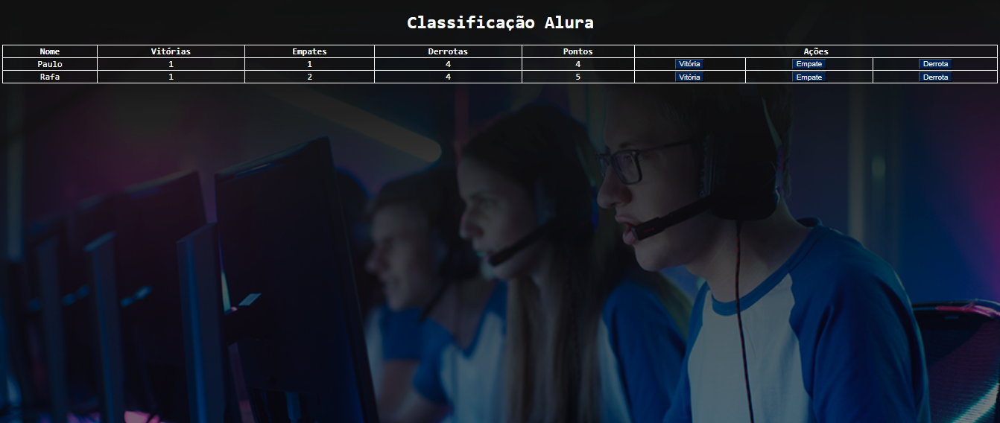

# Imersão dev Alura - Javascript 💻

## Aula 1
- Desafio 1: Criar um conversor de real para bitcoin.
- Desafio 2: Adicionar o nome da pessoa que utiliza a ferramenta.
- Desafio 3: Criar um conversor de anos-luz para metros.

  

## Aula 2
- Desafio 1: Informar se o 'chute' é menor ou maior que o número secreto.
- Desafio 2: Criar um contador para a quantidade de tentativas.
- Desafio 3: Limitar o número máximo de tentativas para acertar o número secreto.
- Desafio 4: Escrever o código utilizando "while" em vez de "for".

  

## Aula 3
- Desafio 1: Condicionar a aparição do filme no catálogo a que ao arquivo de imagem inserido termine em .jpeg ou .jpg:
- Desafio 2: Tentar implementar outras versões da estrutura de repetição que fizemos com for, como por exemplo com foreach ou while.
- Desafio 3: Criar uma lista paralela para exibição dos nomes dos filmes:
- Desafio 4: Criar uma condição para não adicionar filmes repetidos, caso eles já tenham sido adicionados anteriormente.
- Desafio 5: Criar um campo e um botão para adicionar a imagem diretamente na tela, em vez de adicionar no código.

  

  

## Aula 4
- Desafio 1: Condicionar a aceitação do conteúdo digitado no input a um formato válido de imagem.
- Desafio 1 (sessão "Desafios desta aula" na página da imersão): Criar um botão para remover um filme na tela;
- Desafio 2: Fazer com que, ao clicar na imagem do filme, o usuário seja redirecionado para o trailer do filme no YT.
- Desafio 3: Manter uma lista de filmes.

  

  

## Aula 5
- Desafio 1: Adicionar mais jogadores; fazer uma lista com os jogadores; aplicar um laço "for" na function atualizarTabela() para exibir as células de cada jogador;
- Desafio 2: Personalizar a tabela para um jogo de sua preferência (adicionar mais parâmetros e botões).
- Desafio 3: Compartilhar seu projeto.

  

  
